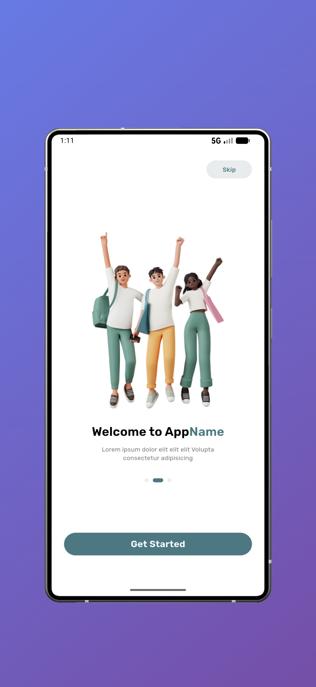
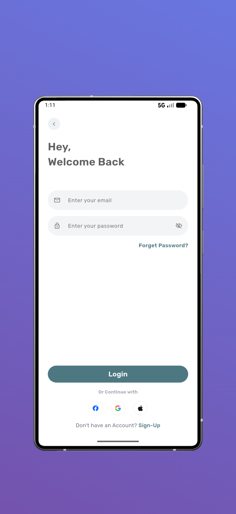
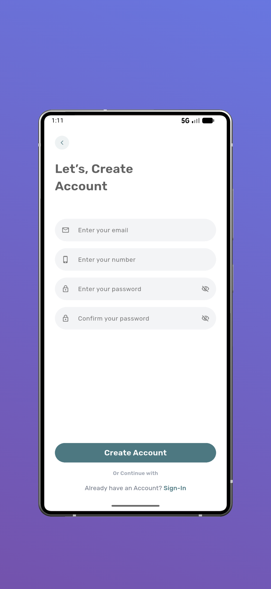

# Task 1 - # Flutter Authentication UI

A simple and clean Flutter app for authentication screens (Welcome, Login, Signup) with a modern UI and reusable components.

## 📸 Screenshots

<div align="center">

| Welcome | Login | Signup |
|---|---|---|
|  |  |  |

</div>

## ✨ Features
- Clean & modern UI  
- Login & Signup screens  
- Reusable custom widgets  
- Responsive layout  
- Ready for social login integration  

## 🛠️ Tech Stack
- Flutter & Dart  
- Google Fonts  
- Custom Components  

## 🚀 Run the App
```bash
flutter pub get
flutter run
3. Run the application
   ```bash
   flutter run
   ```

## 📁 Project Structure

```
lib/
├── main.dart                 # App entry point
├── screens/
│   ├── welcome_screen.dart   # Welcome/home screen
│   ├── login.dart            # Login screen
│   └── signup.dart           # Signup screen
├── customs/                  # Custom UI components
│   ├── custom_button.dart
│   ├── custom_textField.dart
│   ├── custom_social_button.dart
│   ├── custom_tittle.dart
│   └── indicator.dart
└── constants/
    └── app_colors.dart       # Color constants
```

**Built with ❤️ using Flutter**
