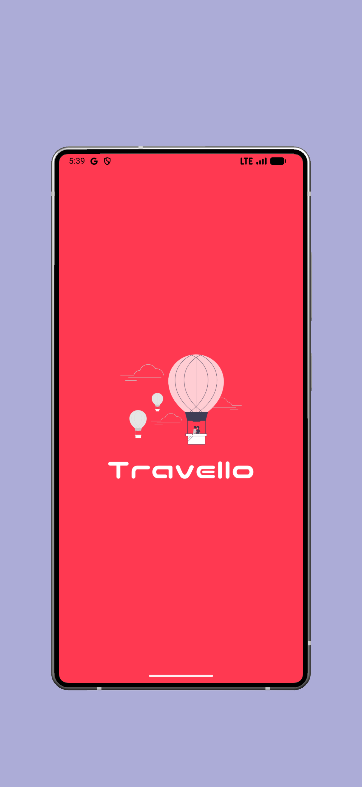
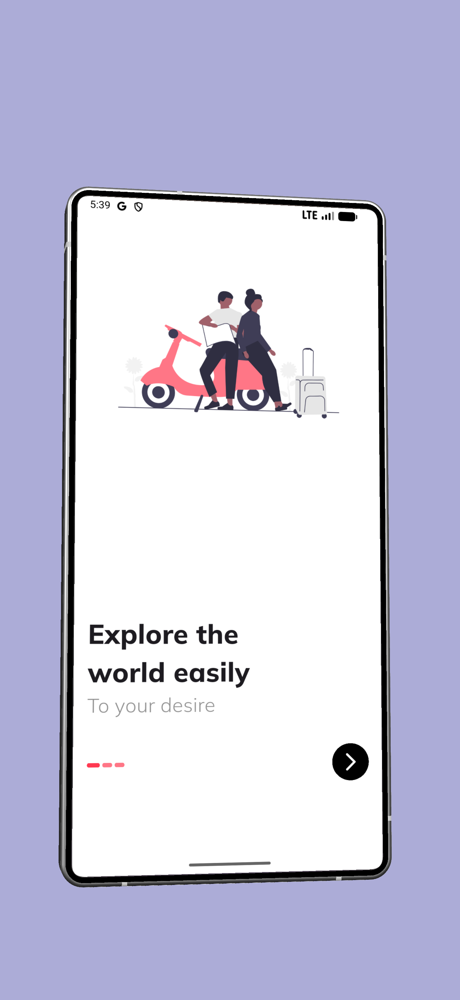
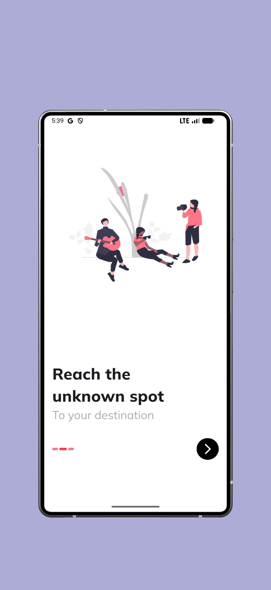
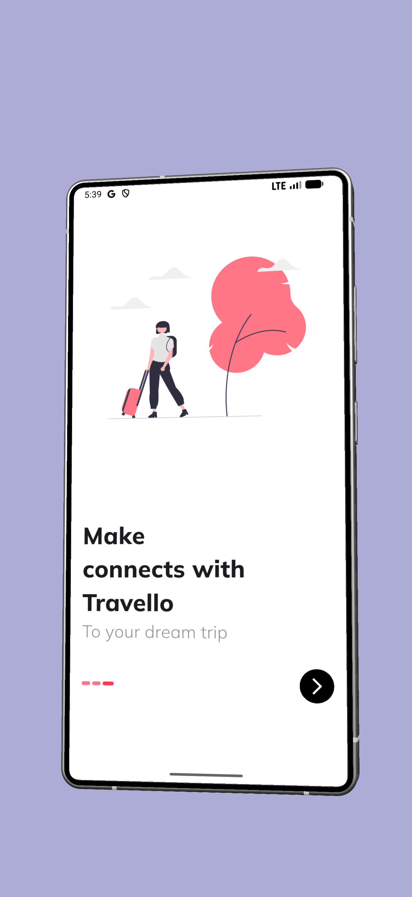
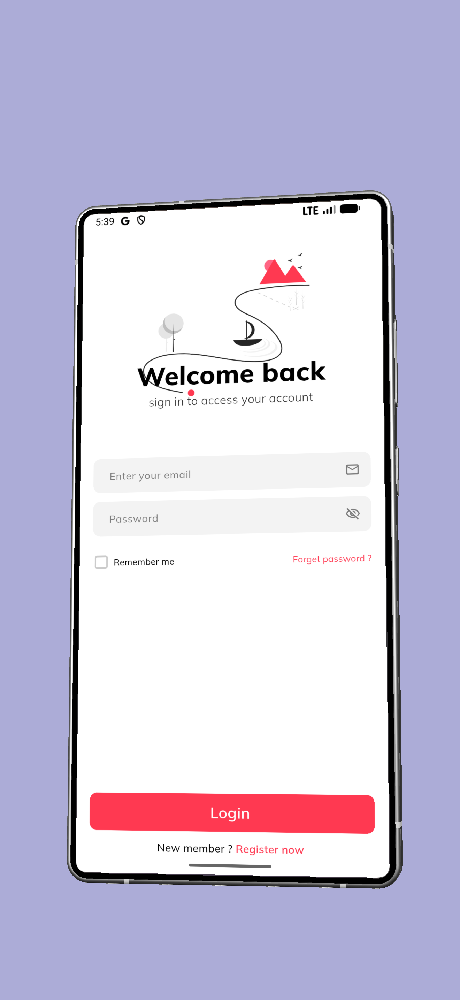
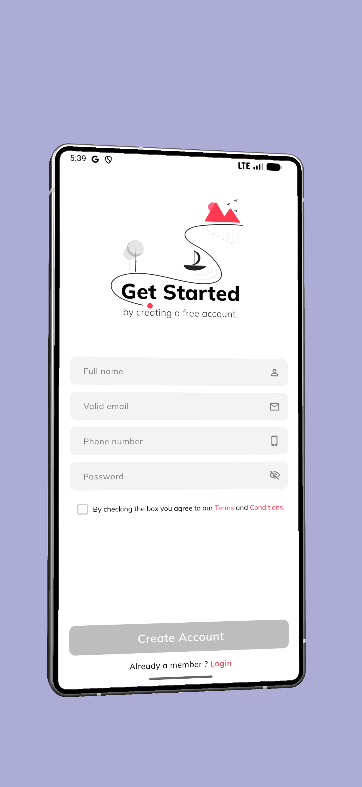
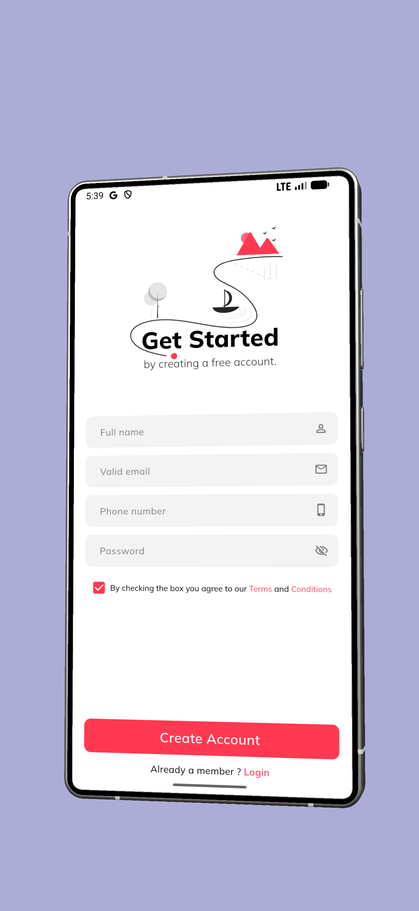
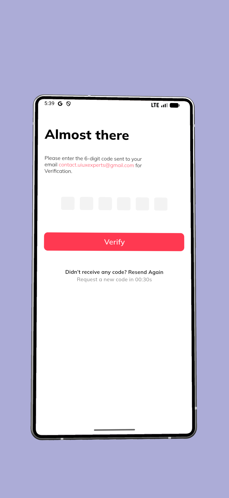
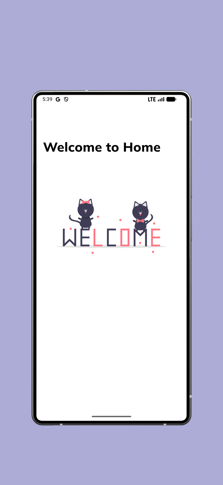

# 🔐 Advanced Authentication & Onboarding UI Kit

A modern Flutter UI showcasing smooth onboarding flows, reusable widgets.

---

## 📸 Screenshots

<div style="display: flex; justify-content: space-around; gap: 10px; flex-wrap: wrap;">
  
  
  
  
  
  
  
  
  
</div>

---

## ✨ Features

- **🎠 Smooth Onboarding Experience** 
- **⌨️ Interactive OTP Field** 
- **🎛️ Smart Button State Management** - Dynamic button states based on form validation and user interaction
- **🎨 Custom UI Components** - Highly reusable and scalable widgets including:
  - CustomTextField with validation states
  - CustomButton with multiple variants
  - CustomHeader with flexible layouts
- **📱 Responsive Design** - Adapts to different screen sizes and keyboard overlays using LayoutBuilder and ConstrainedBox


---

## 🛠️ Tech Stack

- **Framework**: Flutter 3.x
- **Language**: Dart
- **State Management**: StatefulWidget (Core Flutter)
- **UI Components**: Material Design 3


---

## 📁 Project Structure

```
lib/
├── main.dart                          # Application entry point
├── constants/
│   └── app_colors.dart               # Color palette and theme constants
├── models/
│   └── onboarding_data.dart          # Data models for onboarding content
├── screens/
│   ├── splash_screen.dart            # Splash/Loading screen
│   ├── onboarding_screen.dart        # Onboarding flow with PageView
│   ├── login_screen.dart             # User login screen
│   ├── signup_screen.dart            # User registration with terms validation
│   ├── verification_screen.dart      # OTP verification screen
│   └── home_screen.dart              # Main application home screen
└── widgets/
    ├── custom_button.dart            # Reusable button component
    ├── custom_header.dart            # Reusable header component
    └── custom_textfield.dart         # Reusable text input component


```

---

## 🚀 Getting Started


1. **Clone the repository**
   ```bash
   git clone <repository-url>
   cd task_2
   ```

2. **Get dependencies**
   ```bash
   flutter pub get
   ```

3. **Run the application**
   ```bash
   flutter run
   ```


---

<div align="center">

**Built with ❤️ using Flutter**

Made with passion for clean UI/UX design and modern authentication flows

</div>
