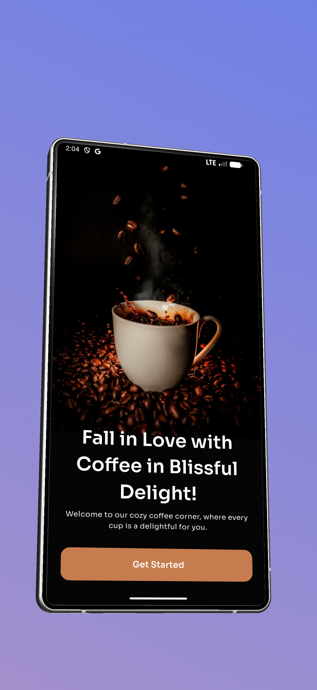
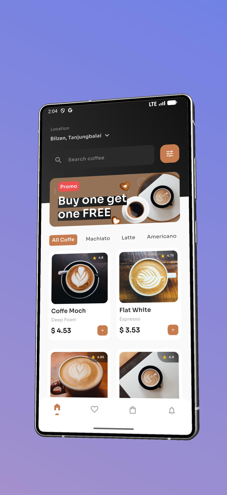
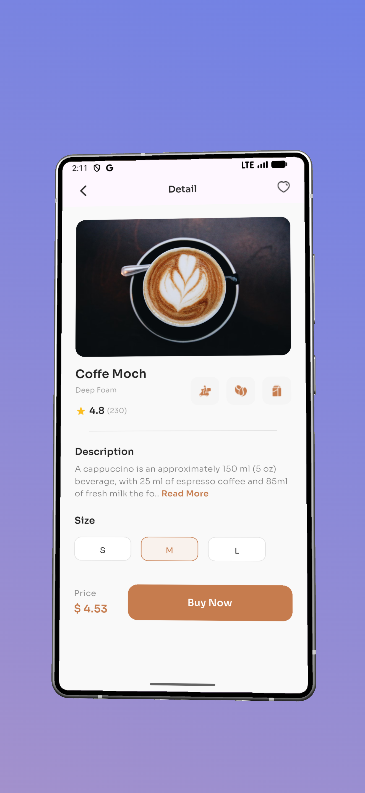
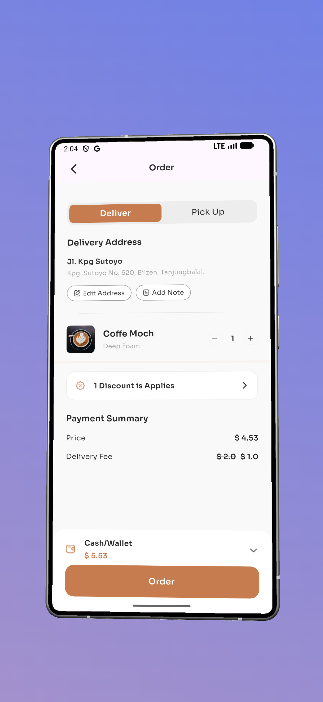
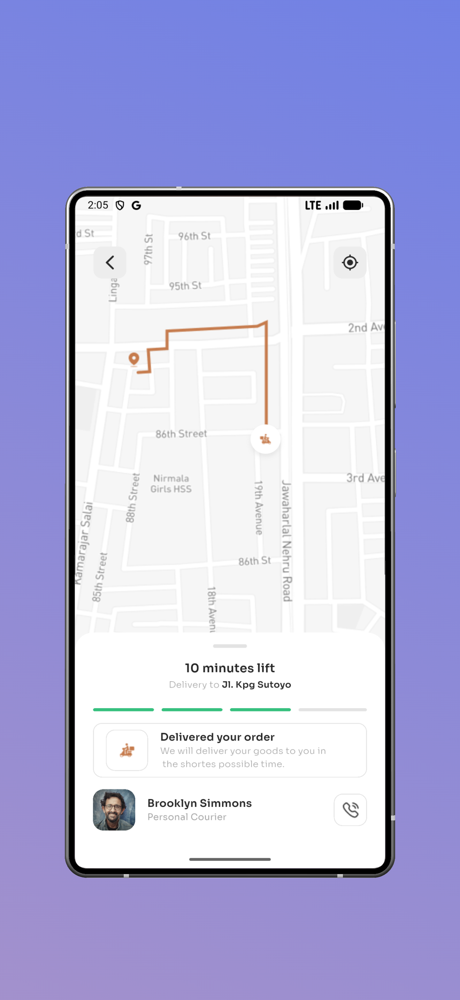

# ☕ Coffee Shop - Premium Mobile UI Kit

A high-fidelity, modern Coffee Shop application built with Flutter. This project showcases a premium user experience with complex UI layouts, custom animations, and a seamless flow from coffee discovery to delivery tracking.

---

## 🎥 Live Demo

<div align="center">
  
  <br>
  <em>Exploring the seamless flow from Home to Delivery Tracking</em>
</div>

---

## 📸 Screenshots

<div style="display: flex; justify-content: space-around; gap: 10px; flex-wrap: wrap;">
  
  
  
  
  
</div>

---

## ✨ Key Features

- **🎨 Pixel-Perfect UI** - Precisely implemented following the High-Fidelity Figma design, focusing on typography (Sora font) and custom spacing.
- **🛠️ Advanced UI Components**:
    - **Draggable Bottom Sheets**: Used in the delivery screen for a smooth, interactive UX.
    - **Custom Navigation Bar**: Implemented with a custom indicator and premium styling.
    - **Conditional Layouts**: Dynamic pricing logic that updates based on "Deliver" vs "Pick Up" selection.
- **🚀 Custom Theming** - Centralized color management using a dedicated `AppColors` constant system.

---

## 🛠️ Tech Stack

- **Framework**: Flutter 3.x
- **Language**: Dart
- **State Management**: StatefulWidget (Logic-driven UI updates)
- **Design System**: Material Design 3 + Custom High-Fidelity Design

---

## 📁 Project Structure

lib/
├── main.dart                      # Application entry point
├── constants/
│   └── app_colors.dart            # Centralized color palette (Primary, Secondary, Text colors)
├── models/
│   └── coffe_model.dart           # Data model for coffee items and categories
├── screens/
│   ├── onboarding.dart            # Entry screen with high-impact visuals
│   ├── home.dart                  # Discovery hub with category filtering & GridView
│   ├── detail_item.dart           # Interactive product details with size selection
│   ├── order.dart                 # Checkout summary with delivery/pickup toggle
│   └── delivery.dart              # Map-based tracking with DraggableScrollableSheet
├── ui_components/
│   └── dark_container.dart        # Specialized UI wrapper for dark-themed sections
└── widgets/
├── coffe_card.dart            # Reusable grid component for coffee items
└── custom_button.dart         # Global styled button with variants

---

## 🚀 Getting Started

1. **Clone the repository**
   ```bash
   git clone <repository-url>
   cd task_2
   ```

2. **Get dependencies**
   ```bash
   flutter pub get
   ```

3. **Run the application**
   ```bash
   flutter run
   ```

   <div align="center">

**Built with ❤️ using Flutter**

Focused on clean code, reusable widgets, and premium UI/UX.

</div>